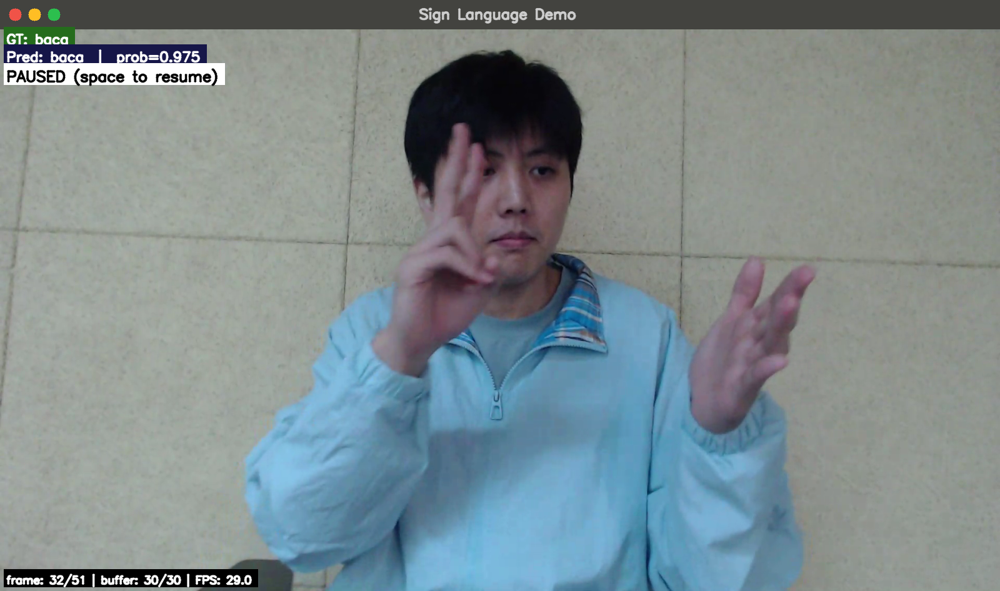
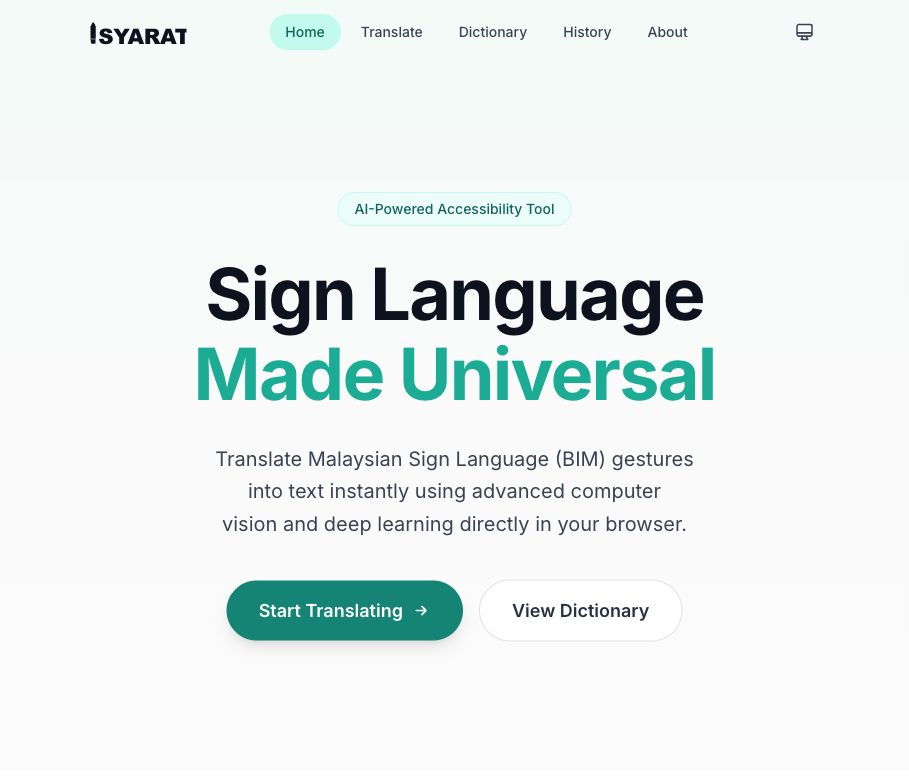
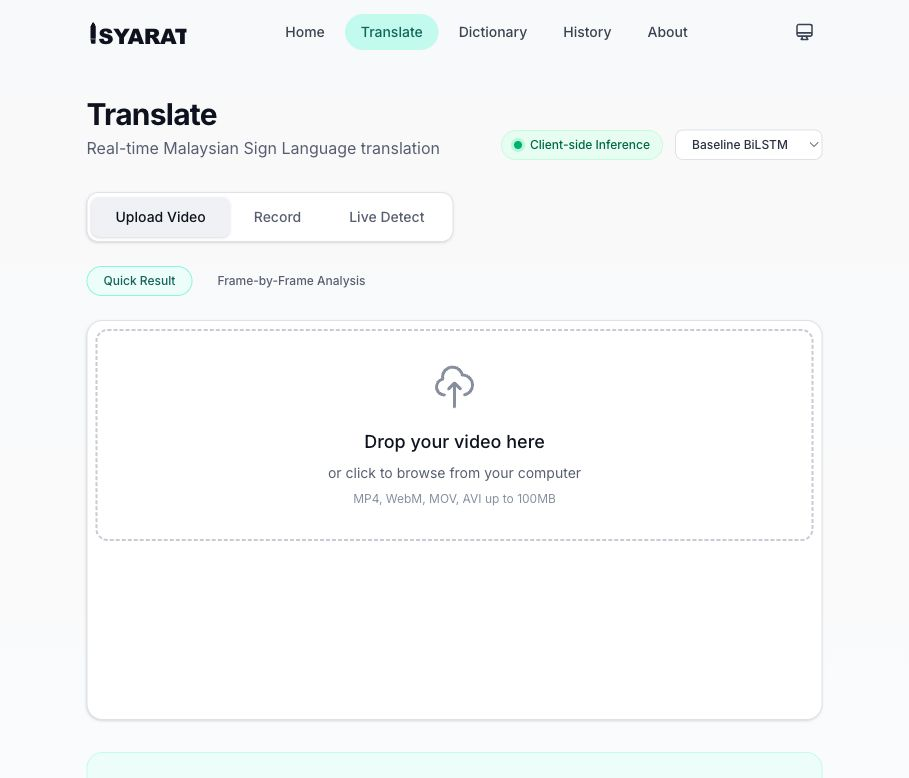

# Malaysian Sign Language

Malaysian Sign Language (BIM) recognition and translation project using MediaPipe keypoints and deep learning sequence models. The repository contains the model training scripts, evaluation utilities, live inference demos, trained checkpoints, dataset preparation scripts, and screenshots for the deployed web interface.

**Live demo:** https://signmy-translate-dev.vercel.app/translate

## Showcase

### Local Inference Demo



### Web App Home



### Web App Translate



## Project Highlights

- MediaPipe Holistic feature extraction with 258-dimensional pose and hand keypoints.
- Sequence-based Malaysian Sign Language classification with BiLSTM, UniLSTM + attention, and causal TCN models.
- Live webcam/video inference scripts with overlayed prediction confidence.
- Client-facing web deployment for browser-based sign language translation.
- Raw BIM Dataset V3 is provided through an external download link instead of being committed to GitHub.

## Repository Structure

```text
.
├── BIM Dataset V3/              # Download note for the raw video dataset
├── NPY Dataset/                 # Lightweight metadata; generated .npy files are ignored
├── assets/                      # README screenshots
├── Dataset_split_6_2_2.py       # Dataset split helper
├── build_npy_from_split.py      # Build processed keypoint arrays
├── Model_Training_BiLSTM.py     # BiLSTM + attention training
├── Model_Training_LSTM.py       # UniLSTM + attention training
├── Model_Training_TCN.py        # Causal TCN training
├── Evaluation.py                # Evaluation utilities
├── Model_Test.py                # Video demo/test script
├── Live_Sign_Language.py        # Gradio webcam demo
├── Live_Test_LSTM.py            # LSTM live test UI
├── Live_Test_TCN.py             # TCN live test UI
├── best_bilstm_attn.pt          # Trained BiLSTM checkpoint
├── best_uni_lstm_attn.pt        # Trained UniLSTM checkpoint
└── best_tcn_causal.pt           # Trained TCN checkpoint
```

## Dataset

The raw `BIM Dataset V3` videos are large and are not stored in this repository.

Download link:

[https://1024terabox.com/s/1vmIwg6wGUwRmZfe9UhB4qQ](https://1024terabox.com/s/1_PK4SNfRcAT_XyRvmE7ygw)

After downloading, extract the gesture folders into `BIM Dataset V3/`.

Processed `.npy` arrays are also excluded from Git because `NPY Dataset/X_TRAIN_2.npy` is slightly above GitHub's 100 MiB file limit. Rebuild the processed arrays locally after downloading the raw dataset.

## Setup

```bash
python3 -m venv .venv
source .venv/bin/activate
pip install -r requirements.txt
```

## Rebuild Processed Data

```bash
python3 Dataset_split_6_2_2.py
python3 build_npy_from_split.py
```

## Train Models

```bash
python3 Model_Training_BiLSTM.py
python3 Model_Training_LSTM.py
python3 Model_Training_TCN.py
```

## Run Local Demo

```bash
python3 Live_Sign_Language.py
```

The Gradio webcam interface loads the BiLSTM attention checkpoint and displays the predicted BIM gesture with confidence.

## Deployed Experience

Try the browser deployment here:

https://signmy-translate-dev.vercel.app/translate
